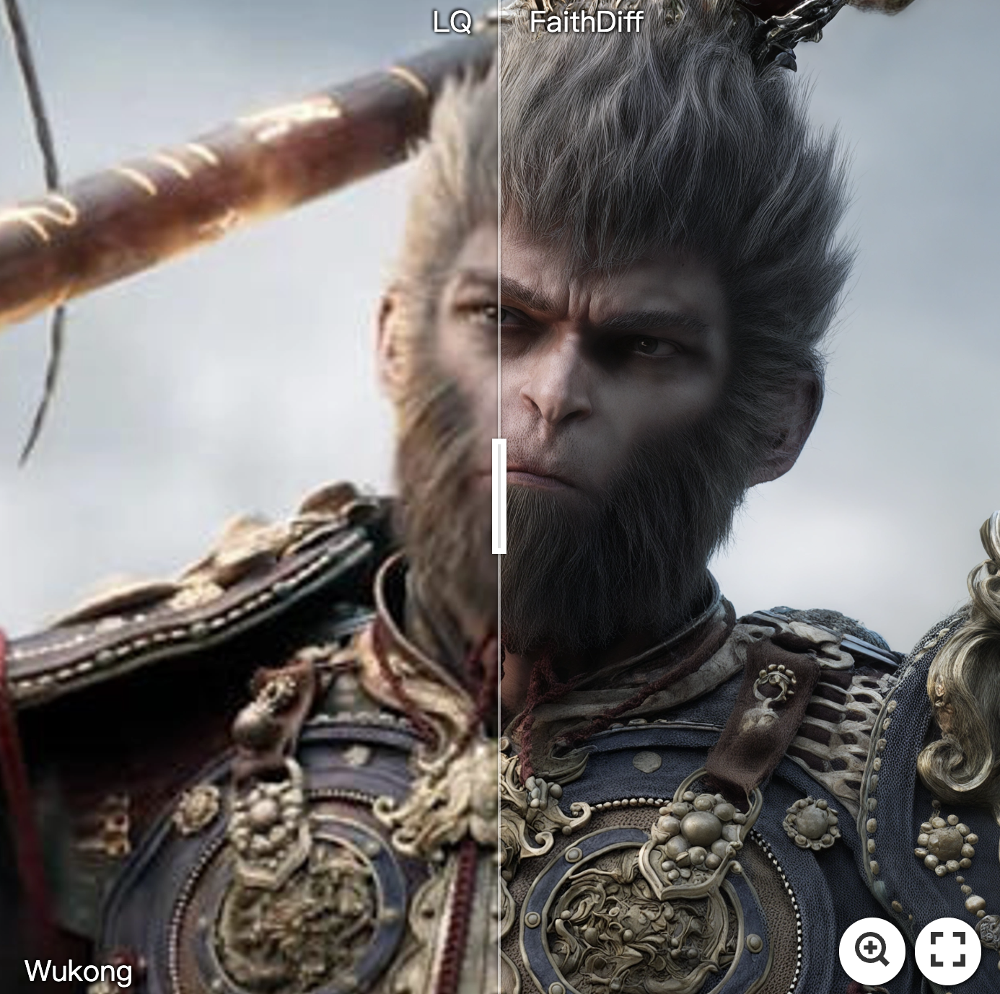
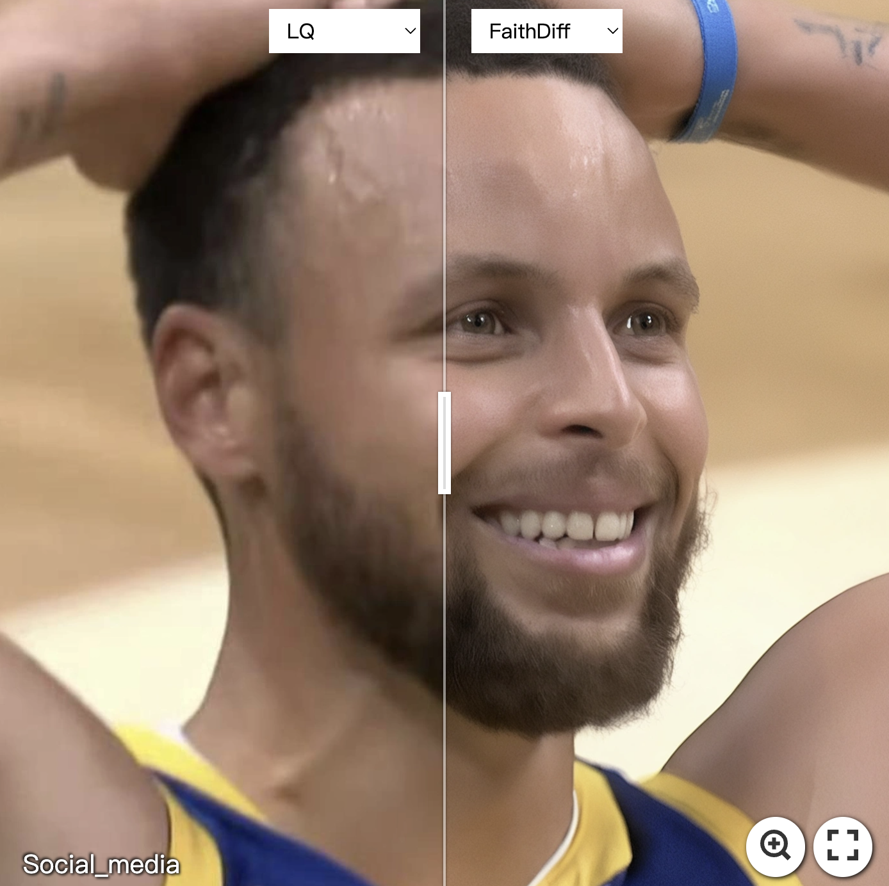
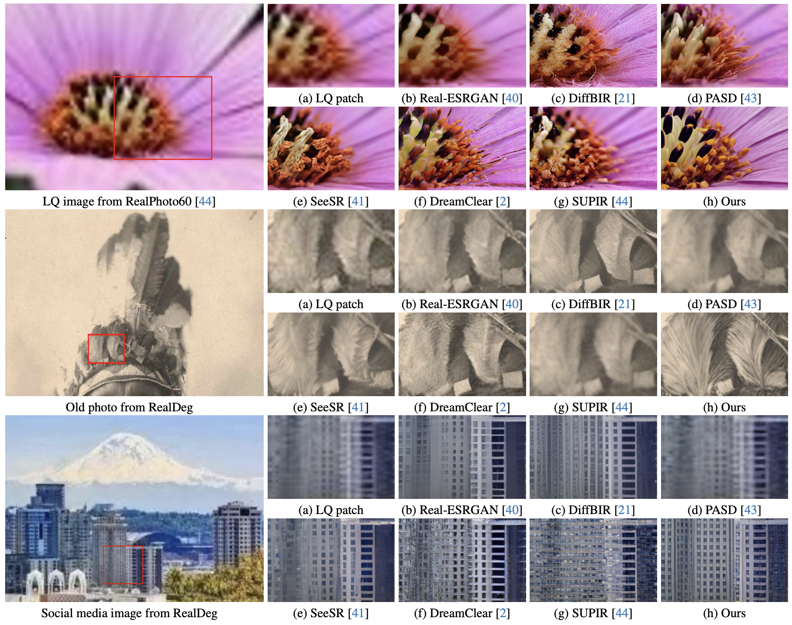
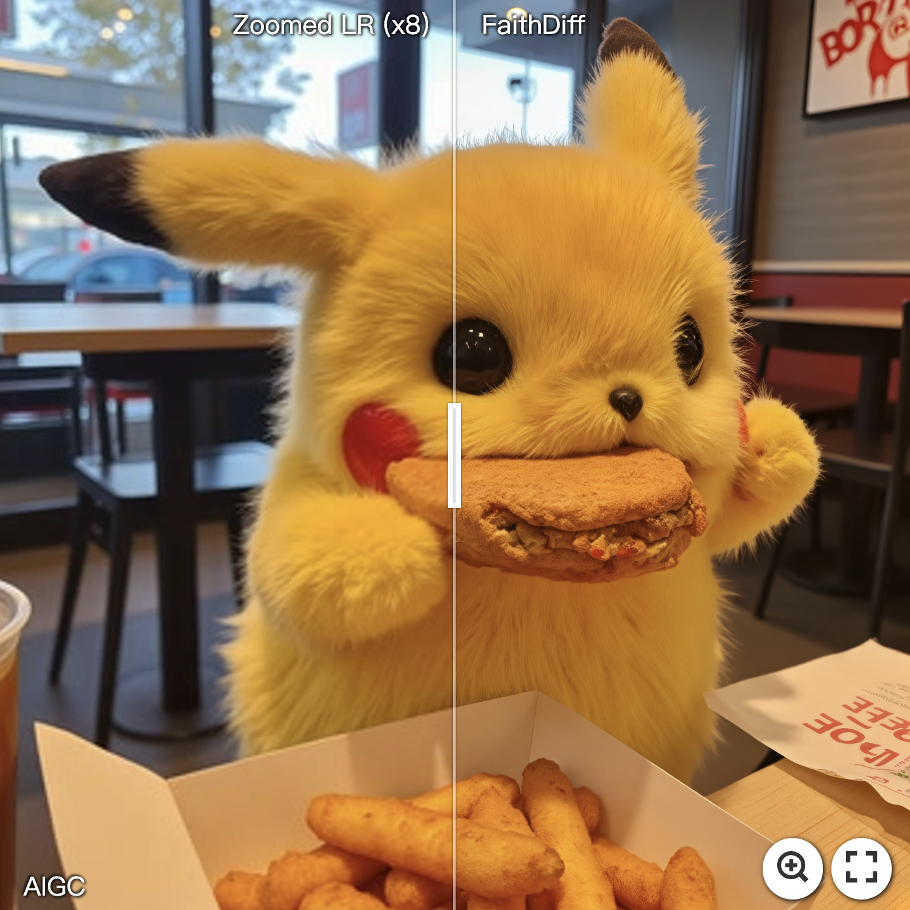
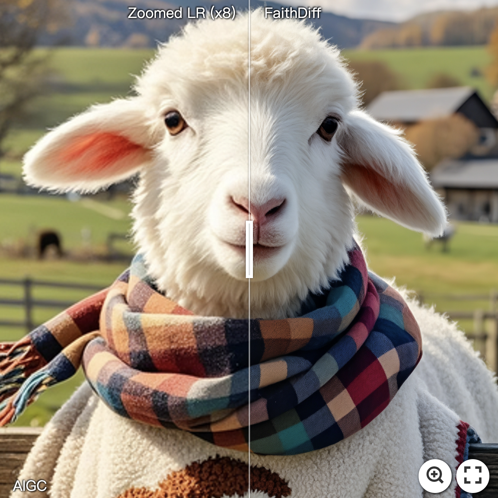
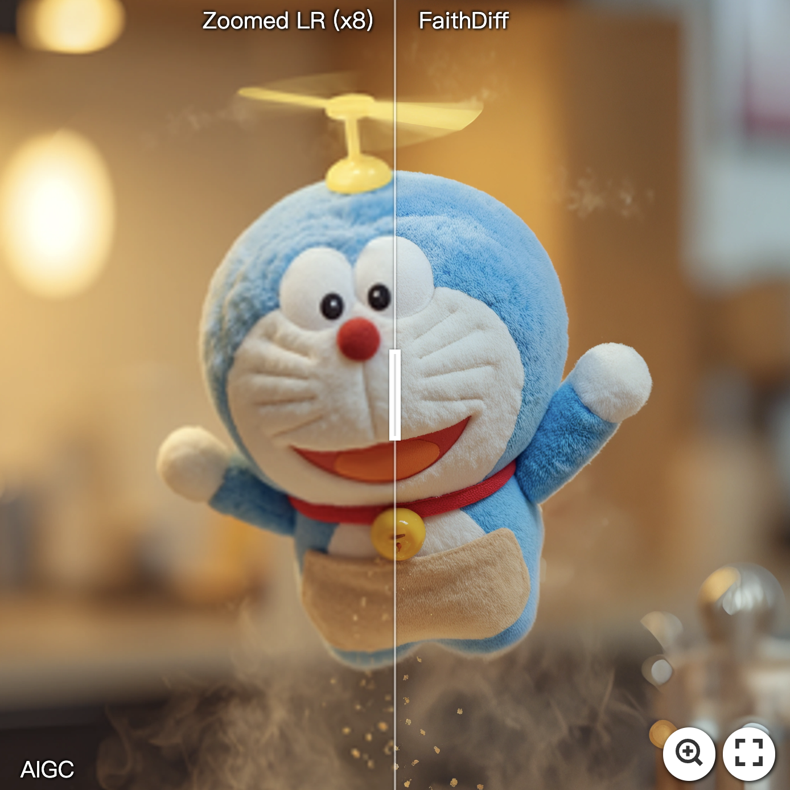
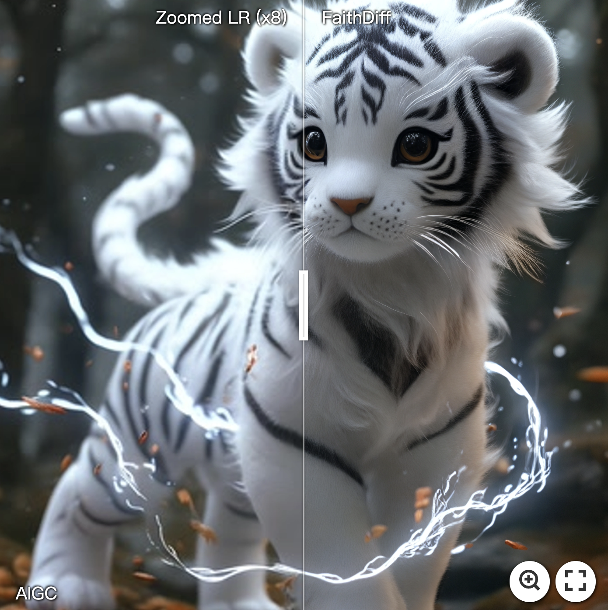
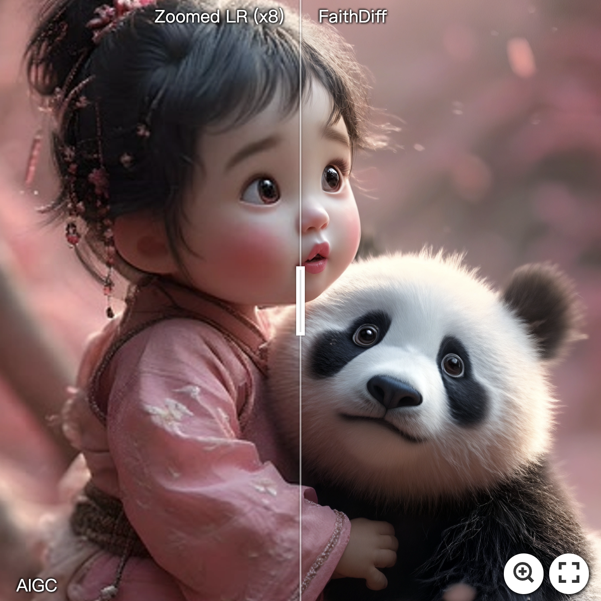
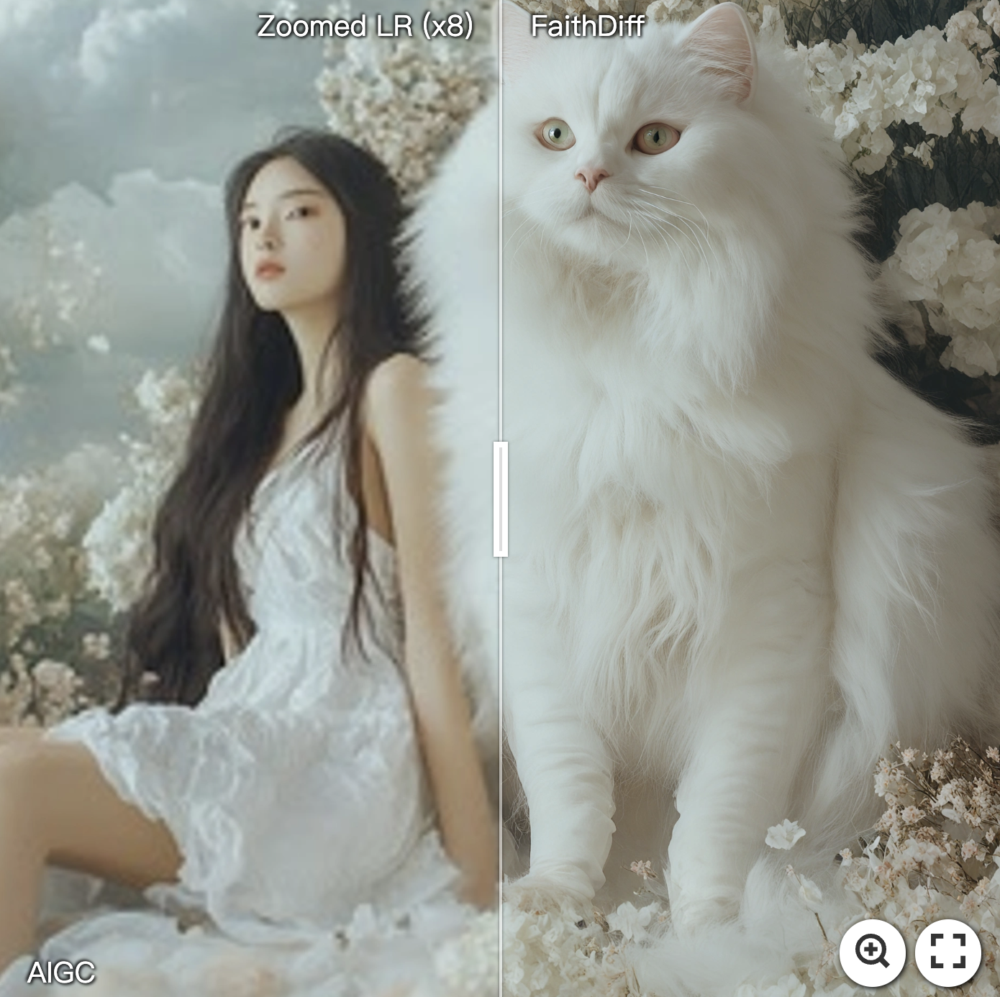
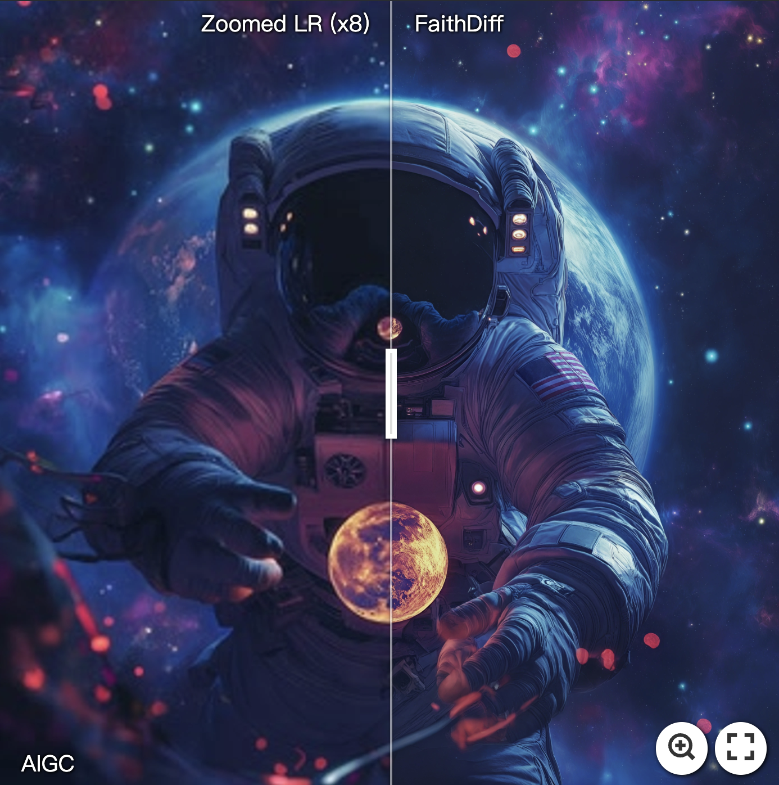

### FaithDiff: Unleashing Diffusion Priors for Faithful Image Super-resolution (CVPR2025)
> [[Project Page](https://jychen9811.github.io/FaithDiff_page/)]  &emsp; [[Paper](https://arxiv.org/abs/2411.18824)]

> [Junyang Chen](https://jychen9811.github.io/), [Jinshan Pan](https://jspan.github.io/), [Jiangxin Dong](https://scholar.google.com/citations?user=ruebFVEAAAAJ&hl=zh-CN&oi=ao) <br>
> [IMAG Lab](https://imag-njust.net/), Nanjing University of Science and Technology


---

### 🚩 **New Features/Updates**
- ✅ February 09, 2025. Support ultra-high-resolution (8K and above) image restoration on 24GB GPUs.
- ✅ February 07, 2025. Release the testing code and [pre-trained model](https://huggingface.co/jychen9811/FaithDiff).
- ✅ November 25, 2024. Creat the repository and the [project page](https://jychen9811.github.io/FaithDiff_page/).

### ⚡ **To do**
- FaithDiff-Flux
- Release the training code
- ~~Release the testing code and pre-trained model~~

---

### 📷 Real-World Enhancement Results
[](https://imgsli.com/MzQ3NDQx) [](https://imgsli.com/MzQ3NDM5)
[](https://imgsli.com/MzQ3NDYx) [](https://imgsli.com/MzQ3NDU2)

<!--  -->

---

### 🌈 AIGC Enhancement Results
[](https://imgsli.com/MzQ3NjEz)
[](https://imgsli.com/MzQ3NjAx)
[](https://imgsli.com/MzQ3NTk0)
[](https://imgsli.com/MzQ3NTk2)
[](https://imgsli.com/MzQ3NjA0)
[](https://imgsli.com/MzQ3NjA2)
[](https://imgsli.com/MzQ3NjE1)
[](https://imgsli.com/MzQ3NjA5)
[](https://imgsli.com/MzQ3NjEw)

### 🚀 How to evaluate

#### Environment
```
conda env create --name faithdiff -f environment.yml
```

#### Download Dependent Models
- [FaithDiff Pre-trained model](https://huggingface.co/jychen9811/FaithDiff)
- [SDXL RealVisXL_V4.0](https://huggingface.co/SG161222/RealVisXL_V4.0)
- [SDXL VAE FP16](https://huggingface.co/madebyollin/sdxl-vae-fp16-fix)
- [LLaVA CLIP](https://huggingface.co/openai/clip-vit-large-patch14-336)
- [LLaVA v1.5 13B](https://huggingface.co/liuhaotian/llava-v1.5-13b)
- Put them in the `./checkpoints` folder and update the corresponding path in CKPT_path.py.

#### Val Dataset
RealDeg: [Google Drive](https://drive.google.com/file/d/1B8BaaMjXJ-1TfcTgE9MrAg8ufvaGkndP/view?usp=sharing)

*To evaluate the performance of our method in real-world scenarios, we collect a dataset of 238 images with unknown degradations, consisting of old photographs, social media images, and classic film stills. The category of old photographs includes black-and-white images, faded photographs, and colorized versions. Social media images are uploaded by us to various social media platforms (e.g., WeChat, RedNote, Sina Weibo and Zhihu), undergoing one or multiple rounds of cross-platform processing. The classic film stills are selected from iconic films spanning the 1980s to 2000s, such as The Shawshank Redemption, Harry Potter, and Spider-Man, etc. The images feature diverse content, including people, buildings, animals, and various natural elements. In addition, the shortest side of the image resolution is at least 720 pixels.*

#### Python Script
```Shell
# Script that support two GPUs. 
CUDA_VISIBLE_DEVICES=0,1 python test.py --img_dir='./dataset/RealDeg' --save_dir=./save/RealDeg --upscale=2 --guidance_scale=5 --num_inference_steps=20 --load_8bit_llava 

# Scripts that support only one GPU.
CUDA_VISIBLE_DEVICES=0 python test_generate_caption.py --img_dir='./dataset/RealDeg' --save_dir=./save/RealDeg_caption --load_8bit_llava
CUDA_VISIBLE_DEVICES=0 python test_wo_llava.py --img_dir='./dataset/RealDeg' --json_dir=./save/RealDeg_caption --save_dir=./save/RealDeg --upscale=2 --guidance_scale=5 --num_inference_steps=20

# If attempting ultra-high-resolution image restoration, add --use_tile_vae in the scripts. The same applies to test_wo_llava.
CUDA_VISIBLE_DEVICES=0,1 python test.py --img_dir='./dataset/RealDeg' --save_dir=./save/RealDeg --use_tile_vae --upscale=8 --guidance_scale=5 --num_inference_steps=20 --load_8bit_llava 
```

---

### BibTeX
    @article{chen2024faithdiff,
    title={FaithDiff: Unleashing Diffusion Priors for Faithful Image Super-resolution},
    author={Chen, Junyang and Pan, Jinshan and Dong, Jiangxin},
    eprint={2411.18824},
    archivePrefix={arXiv},
    primaryClass={cs.CV}
    year={2024}
    }

---

### Contact
If you have any questions, please feel free to reach me out at `jychen9811@gmail.com`.

---

### Acknowledgments
Our project is based on [diffusers](https://github.com/huggingface/diffusers/tree/main), [SUPIR](https://github.com/Fanghua-Yu/SUPIR) and [TLC](https://github.com/megvii-research/TLC). Thanks for their awesome works.


